class: slide 

```{r include=FALSE}
knitr::opts_chunk$set(
  cache = FALSE,
  message = FALSE,
  warning = FALSE,
  eval = TRUE,
  fig.align = "center"
)
```

### Take a tour!

**CRUZ** is the home-made [ThinkR](https://rtask.thinkr.fr) e-learning platform

- Everything you need during the course is available in one place
- The server has all dependencies required for your tutorial
- You can communicate directly with your instructors

<br/><br/>
```{r, echo=FALSE, out.width="50%"}

```
<br/><br/>
**Please take this tour to get used to the platform**

---
class: slide
### Connection

<br/><br/>
```{r, echo=FALSE, out.width="100%"}
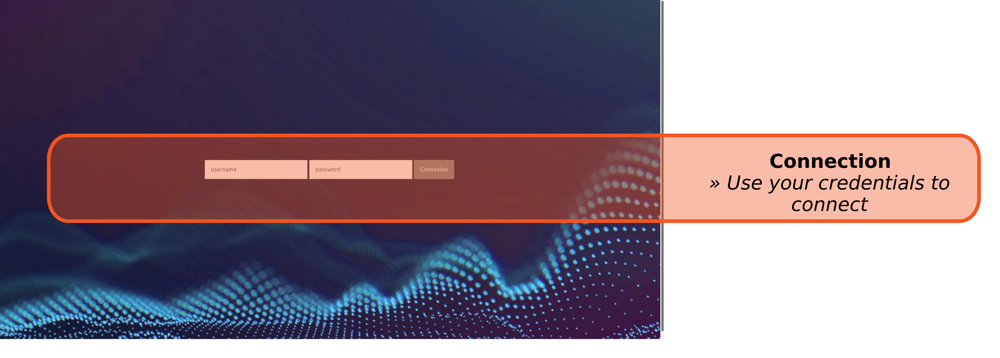
```

---
class: slide
### Home page

<br/><br/>
```{r, echo=FALSE, out.width="100%"}
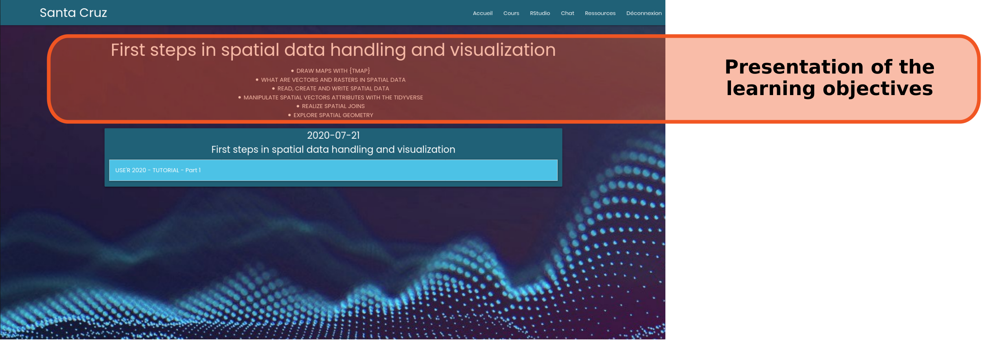
```

---
class: slide

### Home page

<br/><br/>
```{r, echo=FALSE, out.width="100%"}
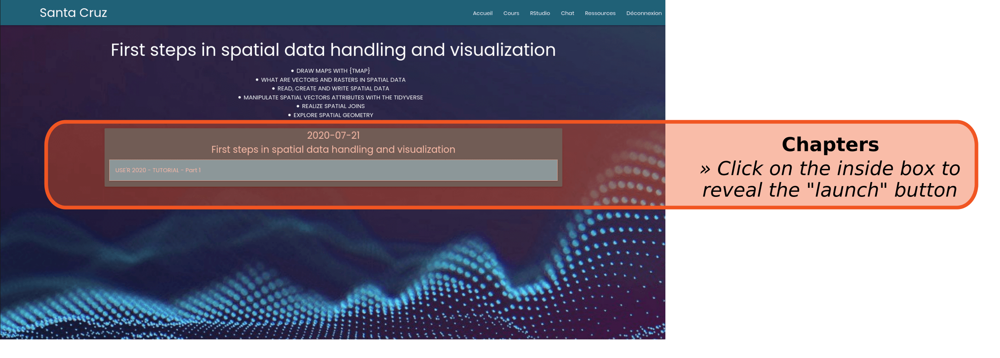
```

---
class: slide

### Home page

<br/><br/>
```{r, echo=FALSE, out.width="100%"}
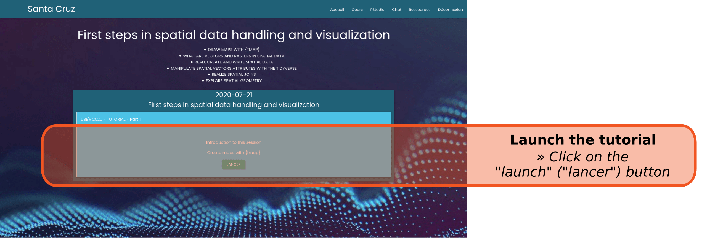
```

---
class: slide

### Pratice

<br/><br/>
```{r, echo=FALSE, out.width="100%"}
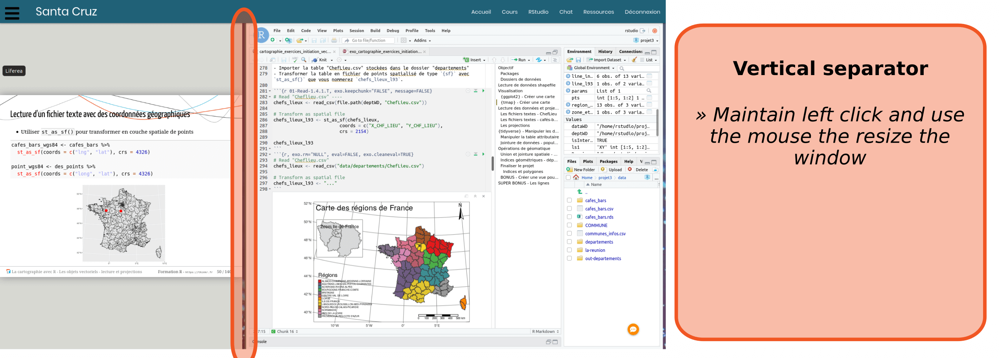
```

---
class: slide

### Pratice

<br/><br/>
```{r, echo=FALSE, out.width="100%"}
knitr::include_graphics("images/05_slides.png")
```

---
class: slide

### Pratice

<br/><br/>
```{r, echo=FALSE, out.width="100%"}
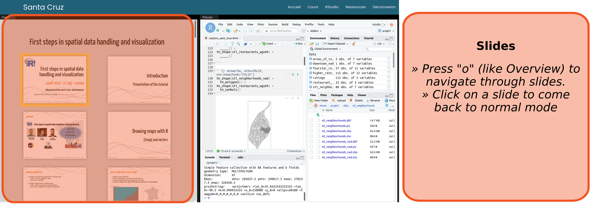
```

---
class: slide

### Pratice

<br/><br/>
```{r, echo=FALSE, out.width="100%"}
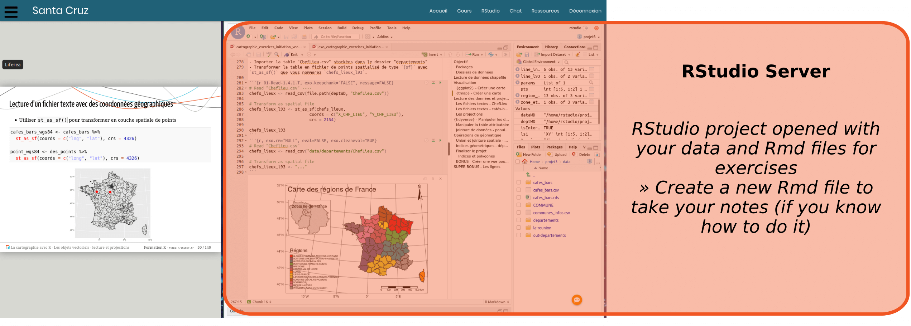
```

---
class: slide

### Export

<br/><br/>
```{r, echo=FALSE, out.width="100%"}
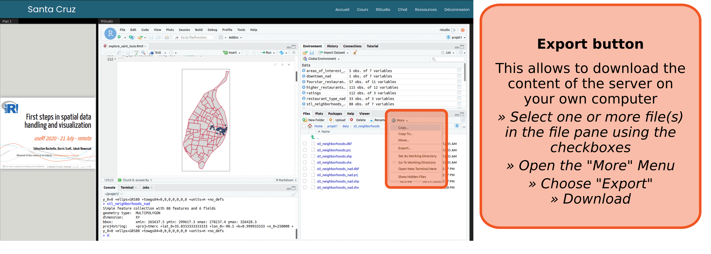
```

*We recommend to download your full project at the end of the course.*

---
class: slide

### Top menu

<br/><br/>
```{r, echo=FALSE, out.width="100%"}
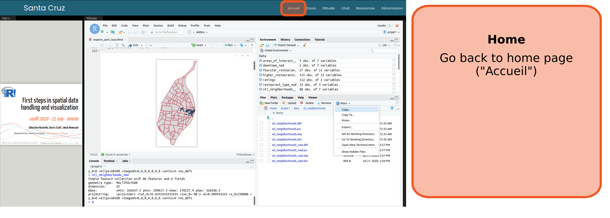
```

---
class: slide

### Top menu

<br/><br/>
```{r, echo=FALSE, out.width="100%"}
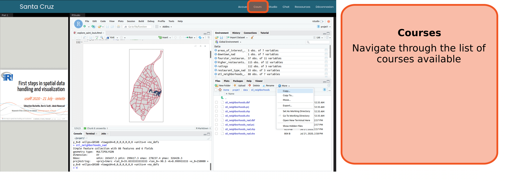
```

---
class: slide

### Top menu

<br/><br/>
```{r, echo=FALSE, out.width="100%"}
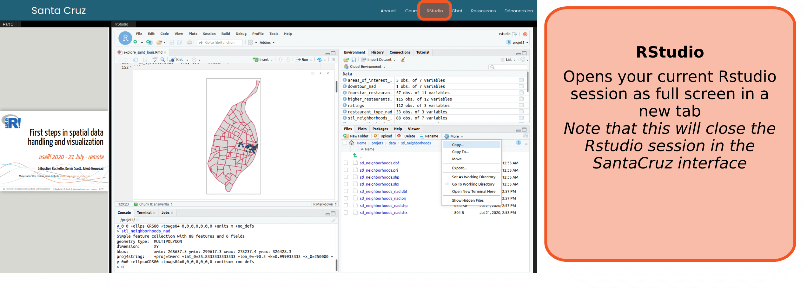
```

---
exclude: true
class: slide

### Top menu

<br/><br/>
```{r, echo=FALSE, out.width="100%"}
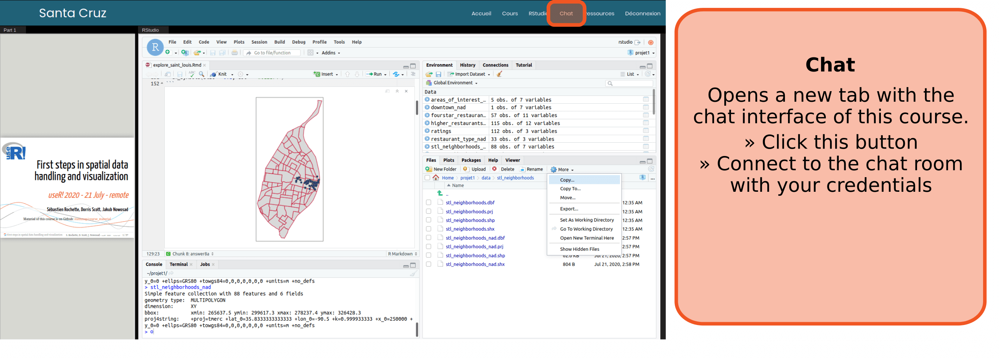
```

---
exclude: true
class: slide

### Chat with us!

<br/><br/>
```{r, echo=FALSE, out.width="100%"}

```

*This will be the place to discuss and share with instructors and other attendees.*

---
class: slide

### Top menu

<br/><br/>
```{r, echo=FALSE, out.width="100%"}
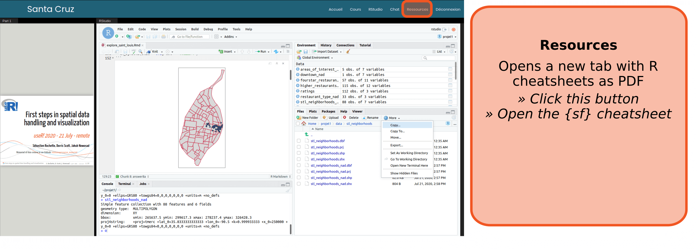
```

---
class: slide

### Top menu

<br/><br/>
```{r, echo=FALSE, out.width="100%"}
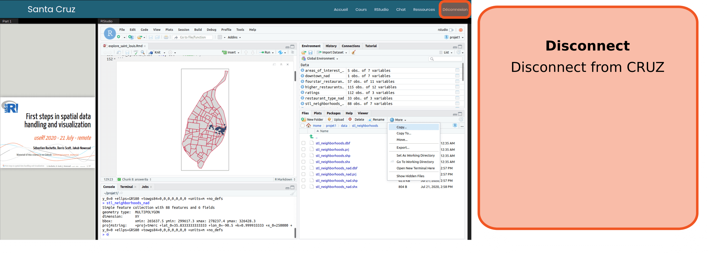
```

