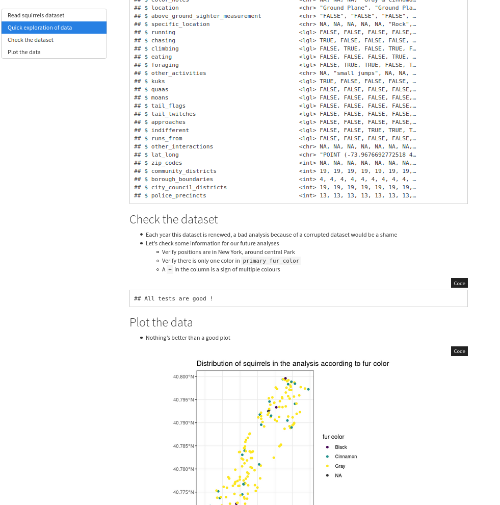
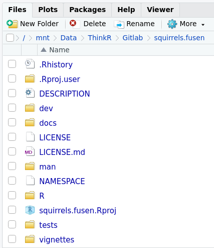

class: slide 

```{r, results='asis', eval=FALSE, echo=FALSE}
# cat('<style>
# .remark-slide-number-left {
#     background: url("', knitr::image_uri("images/marmot.png"),'") no-repeat left top ! important;
# }
# </style>')
```


### Learning goals

- Understand the methodology proposed by the "Rmd First" method
- Be able to refactor a code into correctly formatted functions
- Understand the structure of a package
- Be able to build a documented and tested R package
- Know how to share your work with the community on GitHub

---
class: slide

### Building a package in a few steps

- Start with a Rmd
- Build your functions inside
- Document your functions
- Inflate as a Package

.pull-left[
```{r, echo=FALSE, out.width="90%"}

```

]
.pull-right[
```{r, echo=FALSE, out.width="90%"}

```
]

---
class: slide

### How this tutorial will be held

- E-learning platform: https://cruz.thinkr.fr
- Instructors speak on slides
- Slack group: https://package-rmd-first-dev.slack.com
- Discussion, questions on the Slack group to keep track (better than Zoom)
- Quizz where every attendees will be able to participate on Slack
- Direct questions where attendees are asked to participate
- Hands-on parts, in breakout rooms, where attendees are asked to share their screens for instructors to help


