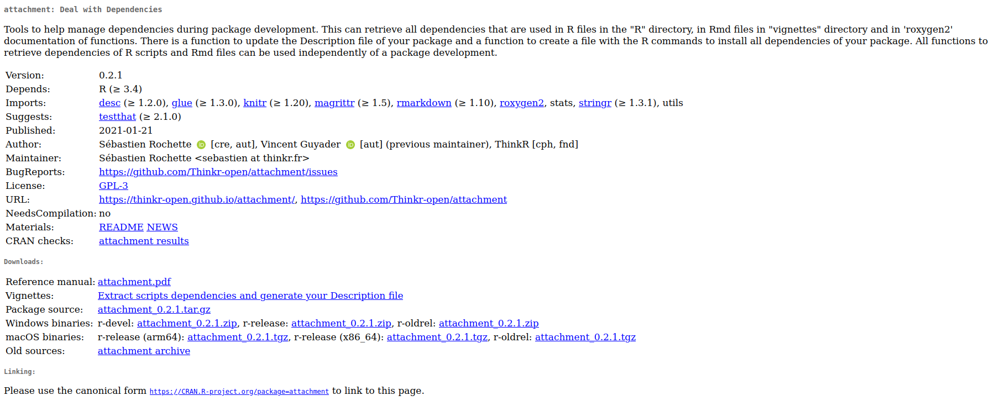
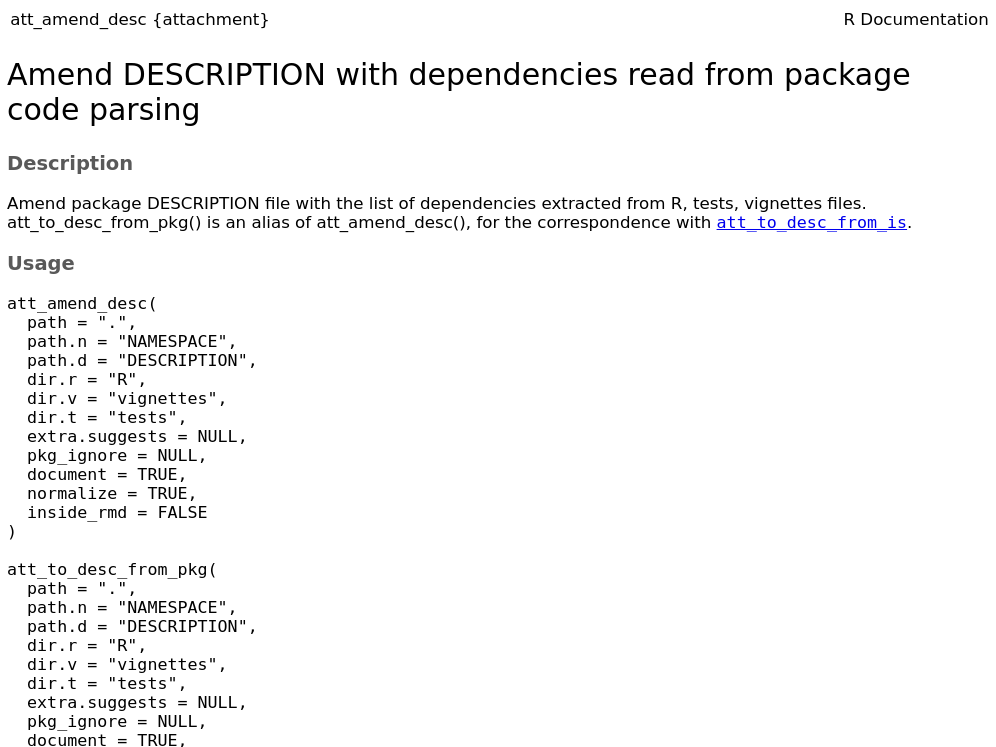
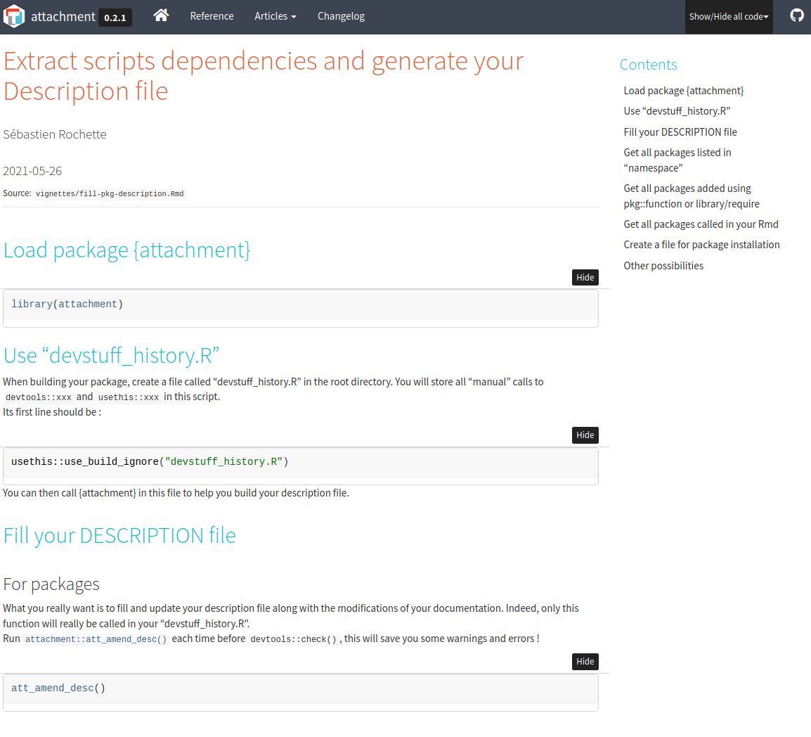
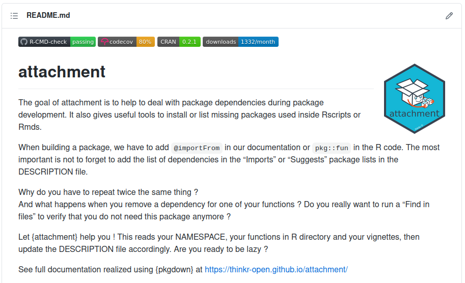

class: slide 

```{r echo=FALSE, include=FALSE}
library(dplyr)
```


### Do you know package {attachment}?

Let's say you don't!

#### How to discover what does a package?

---
class: slide 

### How to discover what does a package?
#### My questions as a user

- What does it do?
- How to install it with its dependencies?
- What are its function?
- How to fill parameters of this function?
- Can I have an example on how to use this function?
- Can I have an example on how to use the package as a whole?
- Will it work with the last version of R and dependencies?

---
class: slide 

### How to discover what does a package?
#### What does it do?

- CRAN page: https://cran.r-project.org/web/packages/attachment/index.html

```{r, echo=FALSE}

```

---
class: slide 

### How to discover what does a package?
#### How to install it with its dependencies?

- `install.packages('attachment')`

???

You don't have to think about dependencies...  
The developers prepared everything for you

---
class: slide 

### How to discover what does a package?
#### What are its functions?

- Index of the package

```{r echo=FALSE, out.width="70%"}
knitr::include_graphics("images/pkg_attachment_index.png")
```

---
class: slide 

### How to discover what does a package?
#### How to fill parameters of this function?

- `?att_amend_desc`

```{r echo=FALSE, out.width="70%"}

```

---
class: slide 

### How to discover what does a package?
#### Can I have an example on how to use this function?

- `?att_amend_desc` => Examples

```{r echo=FALSE, out.width="90%"}
knitr::include_graphics("images/pkg_attachment_examples.png")
```

---
class: slide 

### How to discover what does a package?
#### Can I have an overview on how to use the package as a whole?

- Vignettes
- GitHub: https://thinkr-open.github.io/attachment/articles/fill-pkg-description.html

```{r echo=FALSE, out.width="50%"}

```

---
class: slide 

### How to discover what does a package?
#### Will it work with the last version of R and dependencies?

- README Check, https://github.com/ThinkR-open/attachment
- Unit tests, code coverage, Continuous Integration

```{r echo=FALSE, out.width="80%"}

```

???

Unit tests and CI are set up by developers to ensure reproducibility and maintainability

---
class: slide

### How to discover what does a package?
#### My answers as a user

```{r, echo=FALSE}
tribble(
  ~Questions, ~Answers,
"What does it do?", "<a href='https://cran.r-project.org/web/packages/attachment/index.html'>CRAN page</a>",
"How to install it with its dependencies?", "`install.packages('attachment')`",
"What are its functions?",  "`?attachment` => Index",
"How to fill parameters of this function?", "`?att_amend_desc`",
"Can I have an example on how to use this function?",  "`?att_amend_desc` => Examples",
"Can I have an overview on how to use the package as a whole?", "<a href='https://thinkr-open.github.io/attachment/articles/fill-pkg-description.html'>Vignettes, GitHub</a>",
"Will it work with the last version of R and dependencies?", "<a href='https://github.com/ThinkR-open/attachment'>README Check</a>"
) %>% 
  knitr::kable()
```

_There is a dedicated website that gathers all these answers: https://thinkr-open.github.io/attachment/_

???

We will explore this website later


---
class: slide

### How to discover what does a package?
#### Developers point of view

- All these sources of information are adressed by developers

--

#### If you start with the documentation, from the vignette, you will not have to think too much about all of these

???

You will build all the doc along the way

---
class: slide

### Let's talk again about vignettes

+ HTML pages telling the stories of the package
+ List vignettes using: `vignette(package = "thepackage")`.

```{r, echo=FALSE, out.width="90%"}
knitr::include_graphics("images/vignette.png")
```

---
class: slide 

### Let's talk again about vignettes
 
#### Content of a vignette

```{r eval=FALSE}
vignette(topic = "colwise", package = "dplyr")
```

```{r, echo=FALSE, out.width="60%"}
knitr::include_graphics("images/vignette2.png")
```
 
???

The story of the package as a whole
 
---
class: slide 

### Let's talk again about vignettes

#### Vignette = Rmarkdown (usually)

- What is the story of the package
- What is the function for
- How to use it with or without parameters
- Reproducible examples
- Different outputs depending on chosen parameters

--

#### Let's start building our package from its story ! 
 
---
class: slide

### Quizz: What is a vignette?

- A: A website somewhere on Internet
- B: A Sticker you can add on your laptop
- C: A R script with the help of function accessible in the installed package
- D: A html page built from a Rmd file, accessible in the installed package


---
class: slide

### Quizz: Have you already built a package with all these?

- A: Yes, everything. Functions, examples, tests, vignettes
- B: Only part of documentation. Functions, examples, maybe vignettes
- C: Only functions in a R/ directory
- D: No. I never built a package from scratch
