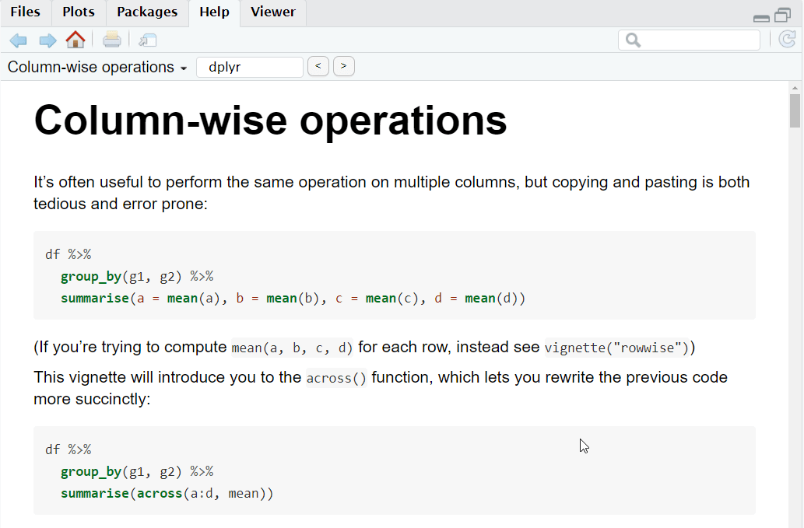

class: slide 

### Let's talk about vignettes
 
#### Package documentation

- An R package contains, among other things, functions
  + Documentation is accessed with `?function_name`

--

- Documentation is also vignettes
  + HTML pages telling the stories of the package
  + List vignettes using: `vignette(package = "thepackage")`.

```{r, echo=FALSE, out.width="90%"}
knitr::include_graphics("images/vignette.png")
```

---
class: slide 

### Let's talk about vignettes
 
#### Content of a vignette

```{r eval=FALSE}
vignette(topic = "colwise", package = "dplyr")
```

```{r, echo=FALSE, out.width="60%"}

```
 
---
class: slide 

### Let's talk about vignettes

#### Vignette = Rmarkdown (usually)

- What is the story of the package
- What is the function for
- How to use it with or without parameters
- Reproducible examples
- Different outputs

--

#### Let's start building our package from its story ! 
 
