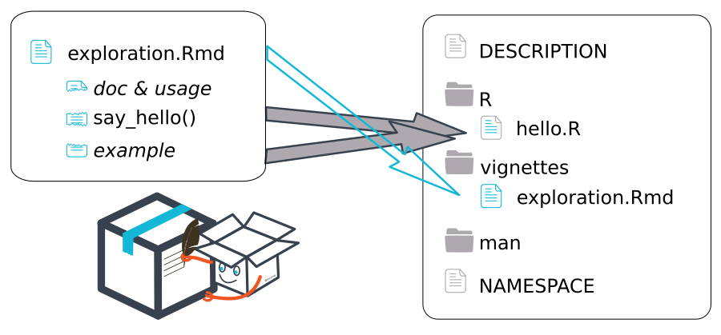

class: slide 

### Preparation : Tools
 
To create a package, we will use :

+ RStudio.
+ the packages {pkgbuild}, {devtools}, {usethis} and {attachment} to save time.
+ the {roxygen2} package to generate the documentation.
+ Rtools.exe (optional and under windows only).

Rtools is available here :   [https://cran.r-project.org/bin/windows/Rtools/](https://cran.r-project.org/bin/windows/Rtools/)  
Once (properly) installed `pkgbuild::has_rtools()` should return `TRUE`. 
Rtools installs everything needed to compile c++ etc.

```{r eval = FALSE}
install.packages(c("devtools", "usethis", "pkgbuild", "roxygen2", "attachment", "testthat"))
```


---
class: slide 
### Preamble

This procedure contains **10 steps**, to be done in order.
Some points are not explained in detail to allow you to obtain a functional R package very quickly.

We suggest you to :

+ Watch your trainers create a package by following these steps, without practicing yourself
--

+ Redo the same package {hello} with your trainers step by step
--

+ Redo this package {hello2} on your own in a new project


---
class: slide 
### Step 1: Create a new "package" project

In Rstudio : 

File > New project > new directory > R package **using devtools**  
We choose the name of the package (explicit, in lower case) and a folder on the computer  

- Name of the package : "hello

> _no capital letters, periods, underscores or spaces_.

---
class: slide 
### Step 2 : Description

The description of the package is done in the "DESCRIPTION" file.  
The first fields to fill in :

- Title: quick description
- Authors : vector of one or more `person`.
- `Authors@R: person("Sébastien", "Rochette", email = "sebastien@thinkr.fr", role = c("aut", "cre"))`

- Description: long description (tab if line feed, period at the end)

> The rest, we'll see later_.

---
class: slide 

### Step 3: dev_history.R

We create a file to save all our manual operations

- Create a "dev/" folder
- In this folder "dev/", create a file "dev_history.R"
- Put the following lines of code in it and execute them

```r
# Hide the dev/ folder and its content for the creation of the package
dir.create("dev")
usethis::use_build_ignore("dev/")
# Define a license
usethis::use_gpl3_license() #usethis::use_mit_license("ThinkR")
# we install a first time the package 'empty
remotes::install_local() 
```

???

Note: you can create an Rmd file "dev_history.Rmd" rather than an R script, but you will need to add the following lines to the YAML under RStudio:_
```yaml
editor_options: 
  chunk_output_type: console
```


---
class: slide 

### Step 4: The vignette

A package is created to automate certain operations.
Starting with the vignette forces you to think about the structure of the package and the logical sequence of operations.

- `usethis::use_vignette("exploration")`

.pull-left[
````markdown
`r ''````{r}
library(hello)
```

## Say hello to someone

`r ''````{r}
print("Hello person")

person <- "Seb"
print(glue::glue("Hello {person}"))
```
````
]


.pull-right[
0. Load your current package
1. Describe with words the first operation that the package will have to solve
2. Define the input data, the possible modifiable parameters, the output result
3. Write the R code to do these operations
]


---
class: slide 

### Step 5: Turn on

As soon as we have a code that performs a specific task, we put it into operation

- *We modify the code in the vignette as we go along*.


````markdown
`r ''````{r}
library(hello)
```

## Say hello to someone
`r ''````{r}
say_hello <- function(person) {
  print(glue::glue("Hello {person}"))
}
```

`r ''````{r}
say_hello(person = "Seb")
```
````


Run your function in your vignette to test it.

???
We have a reproducible example, it will be more useful for unit testing.  
*Tests are essential. You need to create unit tests to check the output format of your function. This ensures that it works even after updates to other packages you use. see {testthat}* syntax


---
class: slide 

### Step 5: Turn on

The created function can now go to the right place

```{r, echo=FALSE, out.width="90%"}

```

---
class: slide 

### Step 5: Put in function

The created function can now go to the right place

- Create a `.R` file in the "R" folder with an explicit name: "hello.R" 
  + `usethis::use_r("hello")`

- Put in the code of the vignette function 
  + We then remove the code of this function from the vignette  

- Add the doc in {roxygen2} format
  + `@export` so that the function is accessible in the global environment
  + `@importFrom` for functions coming from other packages
    + Add and run in "dev_history.R" :
      + `attachment::att_amend_desc()`
      + Look at the update in "DESCRIPTION".
  + `@return` to present the object that exits the function


---
class: slide 

### Step 5 : Put in fonction

.pull-left[
code for "bonjour.R"
```{r, eval=FALSE}
#' Display in the console the greeting to a person
#' 
#' @param person Character. The name of the person to say hello to
#' @importFrom glue
#' @examples
#' say_hello("Seb")
#' @export

say_hello <- function(person) {
  print(glue("Hello {person}"))
}
```
]
.pull-right[
Chunk of the vignette
````markdown
`r ''````{r}
library(hello)
```

## Say hello to someone
`r ''````{r}
say_hello(person = "Seb")
```
````
]


---
class: slide
### Quiz: Finding the right definitions

In what order should you arrange the definitions to associate them with the right file?  

.pull-left[
*Files*  

1. DESCRIPTION  
  
2. dev_history  
  
3. vignette  
  
4. script with roxygen
]
.pull-right[
*Documentation*  
  
A. Development process for developers
  
B. Use of the package for users  
   
C. Use of the functions for the users  
  
D. Content and objectives of the package  
]

???
- 1D and dependencies for installation
- 2A reusable from one package to another
- 3B with a story
- 4C and info for building (@importFrom, @export)

---
class: slide 

### Step 6: Generate the doc

- Generate the doc
  + `attachment::att_amend_desc()`
  + Look at the update in the "man/" folder  
  
- Install the package
  + `remotes::install_local()`
  
- Generate the vignette to check it
  + clicking on knit

  
---
class: slide 

### Step 7: Check the package

Check the package with "Check".

- Build" panel > "Check"
    + or `devtools::check()`  
  
- Solve the problems  

- Reach the **0 Error, 0 Warnings, 0 Notes**.

---
class:slide 

### Step 8: Install the package

- Panel "Build" > "Install and Restart

- Check that the help for your function appears
  + `?say_hello`
  
- Verify that your vignette appears _(you must first do an installation by forcing the creation of a vignette)_ :
      + `remotes::install_local(build_vignettes = TRUE))`
      + `vignette("say-hello", package = "hello")`

---
class: slide 

### Step 9: Distribute the package

Create an archive to distribute with version number

- Panel "Build" > "More" > "Build Source Package

- Can be installed on another computer with :
  + `remotes::install_local("path/to/hello_0.0.1.tar.gz")`

---
class: slide

### Step 10: Present the documentation

Creation of a website dedicated to the presentation of the package

```{r, eval=FALSE}
usethis::use_pkgdown()
pkgdown::build_site()
```

???

usethis::use_pkgdown()puts the /docs folder in the gitignore, and the buildignore.
pkgdown::build_site() will put the site in the docs folder by default


---
class: slide 

### The rest is just as important

- Doing _version control_ with _git
  + `usethis::use_git()`
  
- Add the README to your git repository
  + `usethis::use_readme_rmd()`
  
- Use a test set for your examples and tests
  + `usethis::use_data_raw(name="my_dataset")` : folder to prepare the dataset
  + `usethis::use_data()`: function to create an internal dataset  
  
- Add a version tracking file
  + `usethis::use_news_md()`
  
- Add continuous integration
  + `usethis::use_github_actions()` or `usethis::use_gitlab_ci()`
        


---
class: slide

### Quiz: What to do after each modification?

What operations should be repeated after each modification of the code?

.pull-left[
A. `usethis::use_r()`  
  
C. `attachment::att_amend_desc()`  
]
.pull-right[
B. `devtools::check()`  
  
D. `usethis::use_build_ignore()`  
]

???
- C then B


---
class: slide

### Summary with a dev_history type - Part 1

```{r, eval=FALSE}
# Hide this file for package creation
usethis::use_build_ignore("dev/")
# Define a license
usethis::use_gpl3_license() #usethis::use_mit_license("ThinkR")
# Set up the git
usethis::use_git()
# Create a readme explanation file
usethis::use_readme_rmd()
# Create a vignette to document the use of the package
usethis::use_vignette("say hello")
# Create a function file
usethis::use_r("hello")
# Create a file for testing the functions of the package
usethis::use_testthat()
# Create a test
usethis::use_test(name = "hello")

# Tool to manage dependencies
attachment::att_amend_desc()

# ...
```

---
class: slide

### Summary with a dev_history type - Part 2

```{r, eval=FALSE}
# ...

# Integrate the pipe to the package
usethis::use_pipe()
# Add data
usethis::use_data_raw()
# Add the package doc
usethis::use_package_doc()
# Add continuous integration
usethis::use_github_actions()
usethis::use_gitlab_ci() # Change `image: rocker/verse`
# Add a track changes file
usethis::use_news_md()
# Add a code of conduct
usethis::use_code_of_conduct()
# Create/update site 
usethis::use_pkgdown()
pkgdown::build_site()

# Check its package regularly
devtools::check()
```

