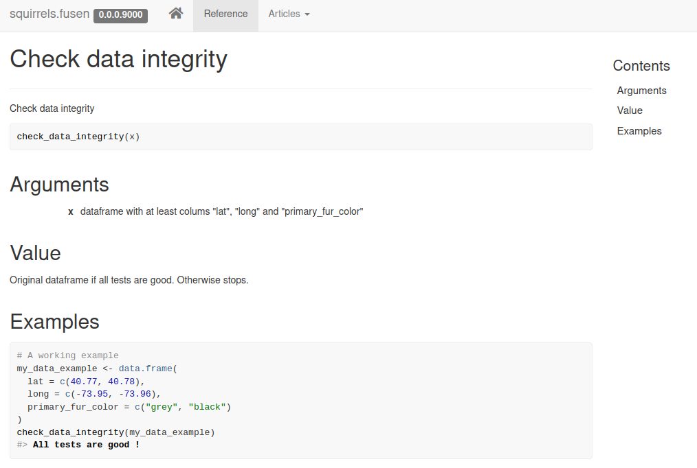

class: slide 

### Preparation : Tools
 
To create a package, we will use :

+ RStudio.
+ {fusen} package
+ the packages {pkgbuild}, {devtools}, {usethis} and {attachment} to save time.
+ the {roxygen2} package to generate the documentation.
+ Rtools.exe (optional and under windows only).


```{r eval = FALSE}
remotes::install_github("ThinkR-open/fusen")
install.packages(c("devtools", "usethis", "pkgbuild", "roxygen2", "attachment", "testthat"))
```

Rtools is available here :   [https://cran.r-project.org/bin/windows/Rtools/](https://cran.r-project.org/bin/windows/Rtools/)  
Once (properly) installed `pkgbuild::has_rtools()` should return `TRUE`. 
Rtools installs everything needed to compile c++ etc.

---
class: slide 

### {fusen} : adopt "Rmd-first" method

- Start with documentation
- Develop everything in a familiar place: the RMarkdown
- {fusen} inflates the package for you

<br/>

> What if there was a package that could take an Rmd file, kind of like a sheet of paper, and if you follow the right folding, you can blow it up like a package?

```{r, echo=FALSE, out.width="80%"}
knitr::include_graphics("images/fusen_fold_inflate.png")
```


---
class: slide 
### Preamble

This procedure contains **10 steps**, to be done in order.
Some points are not explained in detail to allow you to obtain a functional R package very quickly.

We suggest you to :

+ Watch your trainers create a package by following these steps, without practicing yourself
--

+ Redo the same package {hello} with your trainers step by step
--

+ Redo this package {hello2} on your own in a new project

---
class: slide 
### Step 1: Create a new project

In Rstudio : 

File > New project > new directory > New project  
We choose the name of the package (explicit, in lower case) and a folder on the computer

- Name of the package : "hello"

> _no capital letters, periods, underscores or spaces_.

???

You are about to build a package. This is a set of tools to be polite with other people, starting by saying hello.   
Thus, {hello}

---
class: slide

### Step 2 : Add the {fusen} Rmd template

Create the RMarkdown template of your package using {fusen}: "dev_history.Rmd"

```{r, eval=FALSE}
fusen::add_dev_history(name = "minimal")
```

```{r, echo=FALSE, out.width="50%"}
knitr::include_graphics("images/fusen_skeleton.png")
```

???

You can see that {fusen} opens up the "dev_history.Rmd" file in RStudio.  
There are a few additional files that we will explore later.  
This Rmd file is the "minimal" template with different chunks, empty or not empty, that we will fill together in the next steps

---
class: slide 
### Step 3 : Description

The description of the package takes place in the first `description` chunk of the "dev_history.Rmd" file  
The first fields to fill in :

- Title: quick description of the goal of your package
- Description : long description (with a dot at the end of the sentence)
- `Authors@R`: vector of one or more `person` 
  + `person("Sébastien", "Rochette", email = "sebastien@thinkr.fr", role = c("aut", "cre"))`
- License : The choice of the license

<br/>

#### Let's run the content of chunks `development` and `description`

> Observe the content of file "DESCRIPTION" created

???

You are about to build a package, you need to inform the user about its aim. Here, the aim is a set of tools to be polite with other people, starting by saying hello.     
You also need to say who you are, so that users know who to call in case of problems.  
Finally, the license allows you to say how you want your package to be used and shared. Without license, no one is supposed to use your package.

Observe the content of DESCRIPTION. Note that what you wrote in the Rmd is now copied in this file, but you did not have to move from your Rmd. So we stay in the Rmd, and we continue the development.

---
class: slide 

### Step 4 : Documentation of the package

A package is created to automate some operations.
Starting with the documentation forces you to think about the structure of the package and the logical sequence of operations.

- Say what you do in the Rmd text part
- Do what we said in the `function` chunk

.pull-left[
````markdown

## Say hello to someone
`r ''````{r function}
message("Hello someone")

someone <- "Seb"
message(glue::glue("Hello {someone}"))
```
````
]


.pull-right[
1. Describe in words the first operation that the package will have to solve
2. Define the input data, the possible modifiable parameters, the output result
3. Write the R code to perform these operations
]

???

Here we take a simple example with a code to say hello. This will be the first tool of our package to be polite with people around us.  
Forget that you are about to build a package. Now we develop in a Rmd as usual.  
First, we write what we are about to do.  
Then, we write some code to say hello. But, I want it to be able to say hello to someone else than me. 
So I add a parameter.  

---
class: slide 

### Step 5 : Embed in a function

As soon as we have a code that performs a specific task, we embed it in function

- We modify the code in the thumbnail as we go along
- We add examples in the `examples` chunk


````markdown
## Say hello to someone
`r ''````{r function}
say_hello <- function(someone) {
  message(glue::glue("Hello {someone}"))
}
```

`r ''````{r examples}
say_hello(someone = "Seb")
```
````

Run the function in the `examples` chunk of the Rmd to try it


???

- Use the code written previously.  
- Embed in the `function()` function.  
- Use the parameter as a parameter of the function.

- In the examples chunk, we have a reproducible example.
- We will use it as much as we can
- We use it to illustrate the use of the function.
- You'll see that we will also use it for unit tests. Later.

---
class: slide 

### Step 5 : Embed in a function

The created function can now be documented

- Add the doc in {roxygen2} format
  + `@export` for the function to be accessible in the global environment
  + `@importFrom` for functions coming from other packages
  + `@return` to present the object that comes out of the function

> Use RStudio menu: Code > Insert Roxygen Skeleton

???

As you just wrote the code of your function, you know exactly 

- what the aim is,
- what are the parameters for,
- what is the output 
- what are the dependencies needed

Write it now. In an hour, you will have forget it !

Note that:

- because we are in a Rmd, you won't be able to get the autocompletion for roxygen
- because we are in a RStudio Server, the keyboard shortcut for roxygen may be in competition with your browser shortcuts

Let's see how it looks like in the next slide

---
class: slide 

### Step 5 : Embed in a function

````markdown
## Say hello to someone
`r ''````{r function}
#' Show a message in the console to say Hello to someone
#' 
#' @param someone Character. Name of the person to say hello to
#' @importFrom glue glue
#' @return Used for side effect. Outputs a message in the console
#' @examples
#' @export

say_hello <- function(someone) {
  message(glue::glue("Hello {someone}"))
}
```

`r ''````{r examples}
say_hello(someone = "Seb")
```
````

???

Here you can see the minimal roxygen content.  

- Title
- Use of param
- importFrom external dependencies
- return an output. This one's special. There is no re-usable output.
- example is in the following chunk. We will let {fusen} deal with this. This is specific to {fusen} to not fill the example here. We'll see this later.
- export the function to let it available to the user when they will call library(your package)

---
class: slide 

### Step 5 : Write a unit test

````markdown
`r ''````{r tests}
test_that("say_hello works", {
  expect_message(say_hello(someone = "Seb"), "Hello Seb")
})
```
````

???

- We use the same exact example to rite the unit test directly.  
- I won't detail the syntax here, and I won't detail all possible test functions.
- For now, I only want you to have the reflex to do it right after your example, because you already have the test in your mind

---
class: slide

### Step 6 : Inflate the package

```{r, eval=FALSE}
fusen::inflate(rmd = "dev/dev_history.Rmd", name = "Say Hello !")
```

```{r, echo=FALSE, out.width="80%"}
knitr::include_graphics("images/fusen_fold_inflate.png")
```

???

- Let {fusen} inflate the Rmd into a package
- There are multiple messages, we do not read all of them. 
- We try to adress errors at least and re-inflate if needed

---
class: slide

### Step 7 : Explore created folders and files

- "DESCRIPTION" with dépendencies
- "R/" with the function
- "man/" with LateX documentation
- "tests/testthat/" with unit tests
- <span style='color:white;'>"vignettes/" with documentation</span>

```{r, echo=FALSE, out.width="80%"}
knitr::include_graphics("images/fusen_inflate_functions.png")
```


---
class: slide

### Step 7 : Explore created folders and files

- "DESCRIPTION" with dépendencies
- "R/" with the function
- "man/" with LateX documentation
- "tests/testthat/" with unit tests
- "vignettes/" with documentation

```{r, echo=FALSE, out.width="80%"}
knitr::include_graphics("images/fusen_inflate_vignette.png")
```


---
class: slide

### Quizz : Find good definitions

In what order should the definitions be stored to associate them with the correct file/folder? 

.pull-left[
*Files and folders*  

1. DESCRIPTION  
  
2. dev_history  
  
3. vignettes  
  
4. script with roxygen

5. testthat
]
.pull-right[
*Documentation*  
  
A. Development process for developers
  
B. Use of the package for users  
   
C. Use of the functions for the users  

D. Testing the functions for the developers
  
E. Content and objectives of the package for all  
]

???
- 1E and dependencies for installation
- 2A reusable from one package to another
- 3B with a story
- 4C and build info (@importFrom, @export)
- 5D unit tests

---
class: slide 

### Step 8 : Verify again the package

Generate documentation

- `attachment::att_amend_desc()`

Check that the package follows the packages rules

- Panel "Build" > "Check"
    + or `devtools::check()`  
  
- Solve potential problems in the "dev_history.Rmd"
- Re-inflate the package if necessary

- Reach **0 Error, 0 Warnings, 0 Notes**

<br/>

> Note that `fusen::inflate()` already launch this two commands

???

It is always good to know this commands, although `inflate()` already do it. You may need them if you go back to a classical way of maintaining your package

---
class: slide 

### Step 9 : Install and use your package

- Restart your RStudio session
  + The 'Build' tab should appear in RStudio
  
- Install the package
  + Panel "Build" > "Install and Restart
  
- Test the package directly in the console
  + `hello::say_hello("Toto")`

- Test the knit of the thumbnail
  
- Check that the help for your function appears
  + `?say_hello`

---
class: slide

### Step 10 : Present the documentation

Creation of a web site dedicated to the presentation of the package

- Add these lines in the `development` chunk and run

```{r, eval=FALSE}
usethis::use_pkgdown()
pkgdown::build_site()
```

```{r echo=FALSE, out.width="70%"}

```


???

usethis::use_pkgdown() will put the /docs folder in the gitignore, and the buildignore.
pkgdown::build_site() will drop the site into the docs folder by default

---
class: slide

### Your turn

- Second round : accompanied driving
- Third round : in autonomy

> Edit "dev_history.Rmd" and re-execute `inflate()` as many times as necessary until everything runs smoothly.

```{r echo=FALSE, out.width="90%"}
knitr::include_graphics("images/fusen_rmd_folds_pkg.png")
```

---
class: slide

### Quiz

Where were the pieces of code for the :

- `description` ?
- `function` ?
- `example` ?
- `tests` ?
- `development` ?

--

Let's check it together...

- You can run an example of your function directly with Ctrl + Enter
- You can run the unit test by clicking on "Run test"
- You can run the vignette if your package is installed

But be careful, if you want to modify some code, go back to the "dev_history.Rmd" and do `inflate()` again

???

- `description` : in DESCRIPTION
- `function` : in the independent .R file with the name of the function
- `example` : in the independent .R file
  + in the independent .R file with the function name
  + in the thumbnail
- tests`: in the independent tests/testthat folder with the function name
- development`: nowhere. it stays in the development tracking file "dev_history.Rmd


---
class: slide 

### The rest is just as important

- Doing _version control_ with _git
  + `usethis::use_git()`
  
- Add the README to your git repository
  + `usethis::use_readme_rmd()`
  
- Use a test set for your examples and tests
  + `usethis::use_data()`: function to create an internal dataset  
  
- Add a version tracking file
  + `usethis::use_news_md()`
  
- Add continuous integration
  + `usethis::use_github_actions()` or `gitlabr::use_gitlab_ci()`
        
- Add a code of conduct
  + `usethis::use_code_of_conduct()`


???

- These are steps you will be able to add in a `development` chunk, like any {usethis} functions
- We let this here for your future


