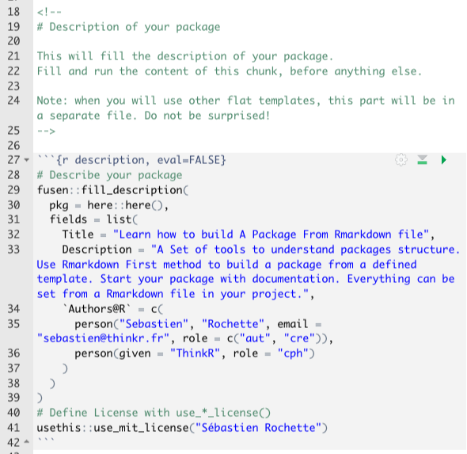
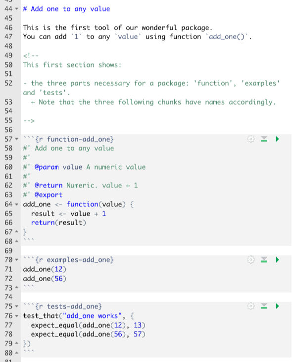
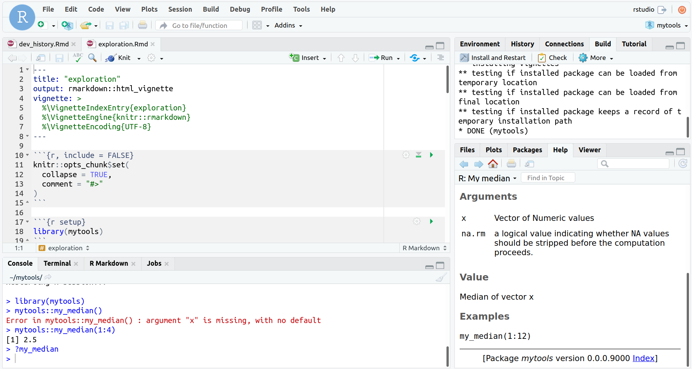

class: slide 

```{r include=FALSE}
# Verify {fusen} works here
library(fusen)
library(testthat)

# Create a new project
dummypackage <- tempfile("inflate.tests")
dir.create(dummypackage)

# {fusen} steps
fill_description(pkg = dummypackage, fields = list(Title = "Dummy Package"))
dev_file <- suppressMessages(add_flat_template(pkg = dummypackage, overwrite = TRUE, open = FALSE))
flat_file <- dev_file[grepl("flat_", dev_file)]

usethis::with_project(dummypackage, {
  suppressMessages(
    inflate(pkg = dummypackage, flat_file = flat_file,
            vignette_name = "Get started", check = FALSE,
            open_vignette = FALSE)
  )
})

test_that("inflate() worked correctly", {
  # R files
  my_median_file <- file.path(dummypackage, "R", "my_median.R")
  expect_true(file.exists(my_median_file))
})
```


### {fusen} : adopt "Rmd-first" method

- Start with documentation
- Develop everything in a familiar place: the RMarkdown
- {fusen} inflates the package for you

<br/>

> What if there was a package that could take an Rmd file, kind of like a sheet of paper, and if you follow the right folding, you can blow it up like a package?

```{r, echo=FALSE, out.width="80%"}
knitr::include_graphics("images/fusen_fold_inflate.png")
```

---
class: slide 
### [Short version] - Preamble

- What are the principal components of a package?
- Where do I have to write what?
- How does {fusen} make my life easier?


We suggest you to :

+ Watch your trainers create a package {mytools} by following these short steps, without practicing yourself

--

+ Redo this package {mytools} on your own in a new project

--

We won't explain everything here, but you will see the components of a package and where they fit. For the details, that's the goal of your complete training!

---
class: slide 
### [Short] 1: Create a new {fusen} project

In Rstudio : 

- File > New project > New directory > Package using {fusen} 
- Choose the name of the package (explicit, in lower case) 
  - Name of the package: "mytools"
> _no capital letters, underscores, spaces or special characters_
- Choose the {fusen} template in the dropdown menu: "teaching"

- Choose the directory where to save the project
- Create the project

```{r, echo=FALSE, out.width="40%"}
knitr::include_graphics("images/new_package_fusen_teaching.png")
```

???

- You are about to build a package. This is a set of tools for testing package structure.   
Thus, {mytools}

- The directory is the "Home" in our platform using `~`


---
class: slide 
### [Short] 2: Open the {fusen} Rmd flat template

- The project opens up on a flat template file: "flat_teaching.Rmd"

--

- Here are the main components of a package, in a unique Rmd file
  + Note the name of the chunks that are required
  + The present file is pre-filled with examples

.pull-left[
```{r, echo=FALSE, out.width="75%"}

```
]

.pull-right[
```{r, echo=FALSE, out.width="75%"}

```
]

???

You can see that {fusen} opens up the "flat_teaching.Rmd" file in RStudio.  
There are a few additional files that we will explore later.  
This Rmd file is the "teaching" template with different chunks, which you will not modify this time.

Let's quickly explore the content of this Rmd. A description, some functions along with examples and tests.
And a final 'development' chunk asking to inflate

---
class: slide 
### [Short] 3 : Description

Describe your future package: 

- Change the name with yours in the `description` chunk
- Execute the complete content of the `description` chunk
  + "CTRL + SHIFT + ENTER" should be good
  + There are two functions to execute here
- A "DESCRIPTION" file appears with the same information

--

#### DESCRIPTION is the first source of documentation for your package

```{r, echo=FALSE, out.width="40%"}
knitr::include_graphics("images/fusen_description_file.png")
```


???

Yeah, you started with documentation !  
There are some more fields in the DESCRIPTION file, but we'll see them later

---
class: slide 
### [Short] 4 : Inflate the package

- Go down the Rmd file and inflate

```{r, eval=FALSE}
fusen::inflate(flat_file = "dev/flat_teaching.Rmd")
```

```{r, echo=FALSE, out.width="80%"}
knitr::include_graphics("images/fusen_fold_inflate.png")
```

--

**You built a package!**

---
class: slide 
### [Short] 5 : Does it work ?

- The 'Build' tab should already appear in RStudio
  + Otherwise, restart your RStudio session

- Install the package
  + Panel Build > Install and Restart
  
- Test the package directly in the console
  + `mytools::add_one(value = 56)`

- Test the knit of the *vignette*
  + The vignette is opened "get-started.Rmd"
  + Hit the "Knit" button
  
- Check that the help for your function appears
  + `?add_one`
  + Run the reproducible example from help

---
class: slide 
### [Short] 5 : Does it work ?

If you verified everything listed above, your RStudio should look like this

```{r, echo=FALSE, out.width="100%"}

```

---
class: slide
### Your turn

#### Go back to section "[Short] 1" and execute the steps yourself until this slide
