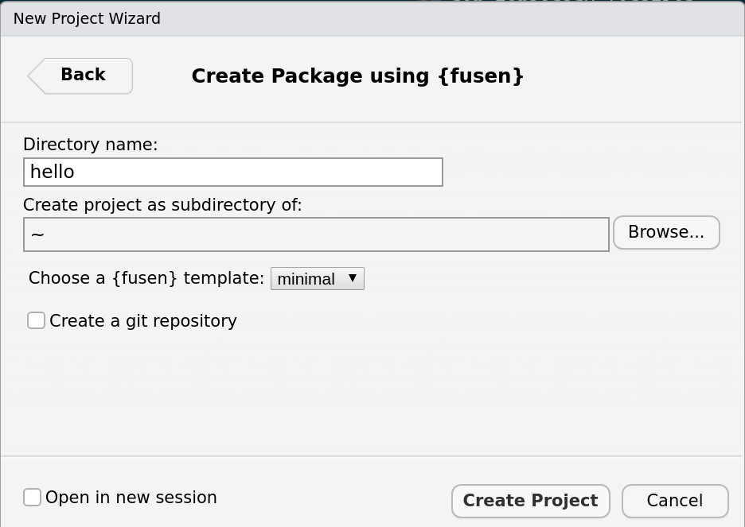
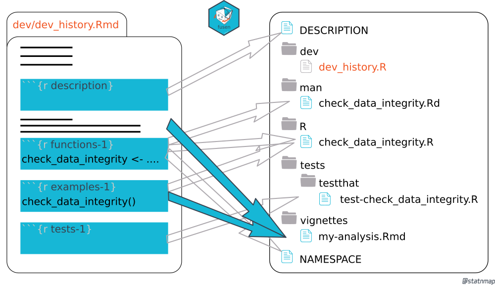
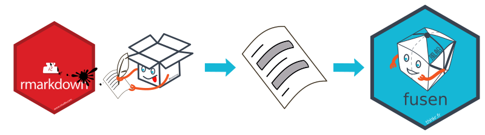

class: slide 

```{r include=FALSE}
# Verify {fusen} works here
library(fusen)
library(testthat)

# Create a new project
dummypackage <- tempfile("inflate.tests")
dir.create(dummypackage)

# {fusen} steps
fill_description(pkg = dummypackage, fields = list(Title = "Dummy Package"))
dev_file <- suppressMessages(add_flat_template(pkg = dummypackage, overwrite = TRUE, open = FALSE))
flat_file <- dev_file[grepl("flat_", dev_file)]

usethis::with_project(dummypackage, {
  suppressMessages(
    inflate(pkg = dummypackage, flat_file = flat_file,
            vignette_name = "Get started", check = FALSE,
            open_vignette = FALSE)
  )
})

test_that("inflate() worked correctly", {
  # R files
  my_median_file <- file.path(dummypackage, "R", "my_median.R")
  expect_true(file.exists(my_median_file))
})
```

### Preparation: Tools
 
To create a package, we will use:

+ RStudio.
+ {fusen} package
+ the packages {pkgbuild}, {devtools}, {usethis} and {attachment} to save time.
+ the {roxygen2} package to generate the documentation.
+ the {testthat} package to generate unit tests.
+ Rtools.exe (optional and under windows only).


```{r eval = FALSE}
install.packages(c("fusen", "devtools", "usethis", "pkgbuild", "roxygen2", "attachment", "testthat"))
```

Rtools is available here:   [https://cran.r-project.org/bin/windows/Rtools/](https://cran.r-project.org/bin/windows/Rtools/)  
Once (properly) installed `pkgbuild::has_rtools()` should return `TRUE`. 
Rtools installs everything needed to compile c++ etc.

???

All of these should be installed on the server already

---
class: slide 

### {fusen}: adopt "Rmd-first" method

- Start with documentation
- Develop everything in a familiar place: the RMarkdown
- {fusen} inflates the package for you

<br/>

> What if there was a package that could take an Rmd file, kind of like a sheet of paper, and if you follow the right folding, you can blow it up like a package?

```{r, echo=FALSE, out.width="80%"}
knitr::include_graphics("images/fusen_fold_inflate.png")
```

---
class: slide

### How {fusen} works?

- {fusen} copy-pastes in the right place

```{r, echo=FALSE, out.width="100%"}
knitr::include_graphics("images/fusen_inflate_functions.png")
```

---
class: slide 
### Longer version - Preamble

This procedure contains **10 steps**, to be done in order.
Some points are not explained in detail to allow you to obtain a functional R package quickly.

We suggest you to:

+ Watch your trainers create a package by following these steps, without practicing yourself
--

+ Do this package {hello} on your own in a new project

--

> Procedure is split in two parts to let you practice. You will thus have 2 times: "Watch - Do"

---
class: slide 
### Step 1: Create a new {fusen} project

In Rstudio: 

- File > New project > New directory > Package using {fusen} 
- Choose the name of the package (explicit, in lower case) 
  - Name of the package: "hello"
> _no capital letters, underscores, spaces or special characters_
- Choose the {fusen} template in the dropdown menu: "minimal"

- Choose the directory where to save the project
- Create the project


```{r, echo=FALSE, out.width="30%"}

```

> You could also directly run: `fusen::create_fusen(path = "~/hello", template = "minimal")`

???

You are about to build a package. This is a set of tools to be polite with other people, starting by saying hello.   
Thus, {hello}

- The directory is the "Home" in our platform using `~`

---
class: slide

### Step 2: Open the {fusen} Rmd templates

This time the template is divided into two flat Rmd files

- "0-dev_history.Rmd" with the general development commands. In particular the `description` part.
- "flat_minimal.Rmd" with the empty skeleton for creating a function like in the previous "teaching" template

```{r, echo=FALSE, out.width="50%"}
knitr::include_graphics("images/flat_minimal_skeleton.png")
```

???

You can see that {fusen} opens up the "0-dev_history.Rmd" file in RStudio.  
There are a few additional files that we will explore later.  
This Rmd file is the "minimal" template with different chunks, empty or not empty, that we will fill together in the next steps

---
class: slide 
### Step 3: Description

The description of the package takes place in the first `description` chunk of the "dev_history.Rmd" file  
  
The first fields to fill in:

- Title: "Quick Description of the Goal of your Package" (Title Case, no dot at the end)
- Description: "Long description. Sentence case with a dot at the end of the sentences."
- `Authors@R`: vector of one or more `person()` 
  + `person("Sébastien", "Rochette", email = "sebastien@thinkr.fr", role = c("aut", "cre"))`
- License: The choice of the license

--

#### Let's run the content of chunk `description`

> Observe the content of file "DESCRIPTION" created

???

You are about to build a package, you need to inform the user about its aim. Here, the aim is a set of tools to be polite with other people, starting by saying hello.     
You also need to say who you are, so that users know who to call in case of problems.  
Finally, the license allows you to say how you want your package to be used and shared. Without license, no one is supposed to use your package.

Observe the content of DESCRIPTION. Note that what you wrote in the Rmd is now copied in this file, but you did not have to move from your Rmd. So we stay in the Rmd, and we continue the development.

---
class: slide 

### Step 4: Documentation of the package

A package is created to automate some operations.
Starting with the documentation forces you to think about the structure of the package and the logical sequence of operations.

- Say what you do in the Rmd text part
- Do what you said in the `function` chunk

#### Open the "flat_minimal.Rmd" template

#### Let's run the content of chunk `development`

---
class: slide 

### Step 4: Documentation of the package

#### Let's see the process of writing a function


.pull-left[
````markdown
## Say hello to someone

You can say hello to someone in particular using `say_hello()`.

```{r development}`r ''`
library(glue) # On top with others

message("Hello someone")

someone <- "Seb"
message(glue("Hello {someone}"))
```
````
]


.pull-right[
1. Describe in words the first operation that the package will have to solve
2. Define the input data, the possible modifiable parameters, the output result
3. Write the R code to perform these operations in a `development` chunk
4. Call necessary packages in a `development` chunk only, at the very beginning, with other `library()` calls
]

???

Here we take a simple example with a code to say hello. This will be the first tool of our package to be polite with people around us.  
Forget that you are about to build a package. Now we develop in a Rmd as usual.  
First, we write what we are about to do.  
Then, we write some code to say hello. But, I want it to be able to say hello to someone else than me. 
So I add a parameter.  

---
class: slide 

### Step 5: Embed in a function

- Move code in the `function` chunk as soon as you transformed it as a function
- Add examples of use in the `examples` chunk


````markdown
## Say hello to someone

You can say hello to someone in particular using `say_hello()`.

```{r function}`r ''`
say_hello <- function(someone) {
  message(glue("Hello {someone}"))
}
```

```{r examples}`r ''`
say_hello(someone = "Seb")
```
````

- Each chunk has a specific task
- Run the chunk `function` to make it available
- Run the function in the `examples` chunk of the Rmd to try it


???

- Use the code written previously.  
- Embed in the `function()` function.  
- Use the parameter as a parameter of the function.

- In the examples chunk, we have a reproducible example.
- We will use it as much as we can
- We use it to illustrate the use of the function.
- You'll see that we will also use it for unit tests. Later.

---
class: slide 

### Step 5: Embed in a function

The created function can now be documented

- Add the doc in {roxygen2} format
  + `@param` to present the content of inputs
  + `@export` for the function to be accessible to the users
  + `@importFrom package function` for functions coming from other packages
  + `@return` to describe the object that comes out of the function

- Use RStudio menu: Code > Insert Roxygen Skeleton

> You must declare the dependencies for the package with `@importFrom`.
The calls to `library()` are only there for development, like a classic Rmd, but are not used by the package when inflated

???

As you just wrote the code of your function, you know exactly 

- what the aim is,
- what are the parameters for,
- what is the output 
- what are the dependencies needed

Write it now. In an hour, you will have forgotten it!

Note that:

- because we are in an Rmd, you won't be able to get the auto-completion for roxygen
- because we are in an RStudio Server, the keyboard shortcut for roxygen may be in competition with your browser shortcuts

Let's see how it looks on the next slide

---
class: slide 

### Step 5: Embed in a function

- Your "flat_minimal.Rmd" file should look like this:

````markdown
## Say hello to someone

You can say hello to someone in particular using `say_hello()`.

```{r function}`r ''`
#' Show a message in the console to say Hello to someone
#' 
#' @param someone Character. Name of the person to say hello to
#' @importFrom glue glue
#' @return Used for side effect. Outputs a message in the console
#' @examples
#' @export

say_hello <- function(someone) {
  message(glue("Hello {someone}"))
}
```

```{r examples}`r ''`
say_hello(someone = "Seb")
```
````

???

Here you can see the minimal roxygen content.  

- Title
- Use of param
- importFrom external dependencies
- return an output. This one's special. There is no re-usable output.
- example is in the following chunk. We will let {fusen} deal with this. This is specific to {fusen} to not fill the example here. We'll see this later.
- export the function to let it available to the user when they will call library(your package)
- There may still be a `development` chunk. That's ok.


---
class: slide

### Your turn!

- We are in the half way point of the process
- Got back to Step 1 of this Longer version
- Follow the 5 steps until this slide

???

Tell us in the Chatroom when you are done

---
class: slide 

### Step 6: Write a unit test

- What do you look for when you run your example?
- What makes you say "it works"?

#### Write your thoughts into code

````markdown
```{r tests}`r ''`
test_that("say_hello works", {
  expect_message(say_hello(someone = "Seb"), "Hello Seb")
})
```
````

???

- We use the same exact example to write the unit test directly.  
- I won't detail the syntax here, and I won't detail all possible test functions.
- For now, I only want you to have the reflex to do it right after your example, because you already have the test in your mind

---
class: slide

### Step 7: Inflate the package

- Let {fusen} inflate the Rmd into a documented and tested package

```{r, eval=FALSE}
fusen::inflate(flat_file = "dev/flat_minimal.Rmd", vignette_name = "Say Hello!")
```

```{r, echo=FALSE, out.width="80%"}
knitr::include_graphics("images/fusen_fold_inflate.png")
```

> If there are any errors or warnings, read them carrefuly, address them in the "flat_minimal.Rmd" and inflate the package again.

???

- Let {fusen} inflate the Rmd into a package
- There are multiple messages, we do not read all of them. 
- We try to address errors at least and re-inflate if needed

---
class: slide

### Step 8: Explore created folders and files

- "DESCRIPTION" with dependencies
- "R/" with the function
- "man/" with LateX documentation
- "tests/testthat/" with unit tests
- <span style='color:white;'>"vignettes/" with documentation</span>

```{r, echo=FALSE, out.width="80%"}
knitr::include_graphics("images/fusen_inflate_functions.png")
```


---
class: slide

### Step 8: Explore created folders and files

- "DESCRIPTION" with dependencies
- "R/" with the function
- "man/" with LateX documentation
- "tests/testthat/" with unit tests
- "vignettes/" with documentation

```{r, echo=FALSE, out.width="80%"}

```


---
class: slide

### Quiz: Find good definitions

Link files to their description:

.pull-left[
*Files and folders*  

1. DESCRIPTION  
  
2. dev_history / flat_minimal  
  
3. vignettes  
  
4. script with roxygen

5. testthat

<br/>
<br/>
<br/>
**Possible answers:**

- a: ACBDE

- c: EABCD
]
.pull-right[
*Documentation*  
  
A. Development process for developers
  
B. Present all the functions of the package and its story  
   
C. How to use each function (for the user)  

D. Testing the functions for the developers
  
E. Content and objectives of the package for all  

<br/>
<br/>
- b: EDCBA

- d: BAECD
]

???
- 1E and dependencies for installation
- 2A reusable from one package to another
- 3B with a story
- 4C and build info (@importFrom, @export)
- 5D unit tests

---
class: slide 

### Step 9: Verify again the package

Generate documentation

- `attachment::att_amend_desc()`

Check that the package follows the packages rules

- `devtools::check()`  
  
- Solve potential problems in the "flat_minimal.Rmd"
- Re-inflate the package if necessary

- Reach **0 Error, 0 Warnings, 0 Notes**

> Store this commands in the "0-dev_history.Rmd" file

<br/>

> Note that `fusen::inflate()` already launches this two commands, but who knows!

???

It is always good to know these commands, although `inflate()` already does them. You may need them if you go back to a classical way of maintaining your package

---
class: slide 

### Step 10: Install and use your package

- The 'Build' tab should already appear in RStudio
  + Otherwise, restart your RStudio session
  
- Note that you can "check" in the 'Build' panel
  + Panel "Build" > "Check"
  
- Install the package
  + Panel "Build" > "Install and Restart
  
- Test the package directly in the console
  + `hello::say_hello("Toto")`

- Test the knit of the vignette
  
- Check that the help for your function appears
  + `?say_hello`
  + Run the reproducible example from help

---
class: slide

### Your turn

- Go back to step 6 of this Longer version
- Continue development and inflate your package

> Edit "flat_minimal.Rmd" and re-execute `inflate()` as many times as necessary until everything runs smoothly.

<br/>
```{r echo=FALSE, out.width="90%"}

```

<br/>
<br/>
> Bonus: If you are motivated, you can start again from the beginning of the 10 steps procedure with a new package name {hello2}

---
class: slide

### How to add new functionnalities?

This would require to start over from 'Step 4' to:

- Upgrade your existing function

- Add a new function in the current flat template
  + New entitled section with `function`, `examples`, `tests`
  + Inflate
  + Install
  
- There is a RStudio _Addin_ to "Add {fusen} chunks"

--

- Or create a new flat template using `fusen::add_flat_template("add")` for a new family of functions, thus new vignette

- There is a RStudio _Addin_ to "Add {fusen} flat template"

--

- And `inflate()` this new "flat_additional.Rmd"

---
class: slide

### And the classical way without {fusen}?

- You can use the 'Rmd first ' approach writing your code in a Rmarkdown file
  + this can directly be your vignette
- Then, you'll need to fill / copy the different files yourself
  - "R/"
  - "tests/"
  - "vignettes/"
  

---
class: slide

### And the classical way without {fusen}?

- File > New Project > New directory > Package with devtools
- Fill DESCRIPTION file
- Run function for the desired license
  + `usethis::use_*_license()`
- Develop in a Rmd
  + Either in the sub-directory "dev/" + `usethis::use_build_ignore("dev/")`
  + Or, develop in a vignette directly
- Copy/Cut in the correct place
  + functions + examples => "R/"
      + `usethis::use_r("ma_fonction")`
  + tests => "tests/testthat/"
      + `usethis::use_testthat()`
      + `usethis::use_test("ma_fonction")`
  + vignettes => "vignettes/"
      + `usethis::use_vignette("Le titre de ma vignette")`
- Generate documentation
  + Either `attachment::att_amend_desc()`
  + Ou `roxygen2::roxygenise()` + Fill in DESCRIPTION (Suggests, Imports)
- Check the package
  + `devtools::check()` => `0 errors, 0 warnings, 0 notes`

---
class: slide

### And the classical way without {fusen}?

- You need to fill the different files yourself
  - "R/"
  - "tests/"
  - "vignettes/"

- While developing you could
  - Run an example of your function in "R/" directly with Ctrl + Enter
  - Run the unit test by clicking on "Run test"
  - Run the vignette if your package is installed

- Note that you can still do these actions using {fusen} after `inflate()`

> Be careful, when using {fusen}, if you want to modify some code, go back to the "flat_*.Rmd" and do `inflate()` again

???

Show that we can do it with fusen too as it is a real classical package

---
class: slide

### Exercise: Take time to finish your drawings

Where were moved the pieces of code from chunks:

- `description`?
- `function`?
- `example`?
- `tests`?
- `development`?

> Verify and update your previous drawings.
> See each thing that {fusen} does for you!

???

- `description`: in DESCRIPTION
- `function`: in the independent .R file with the name of the function
- `example`: in the independent .R file
  + in the independent .R file with the function name
  + in the thumbnail
- tests`: in the independent tests/testthat folder with the function name
- development`: nowhere. it stays in the development tracking file "dev_history.Rmd

