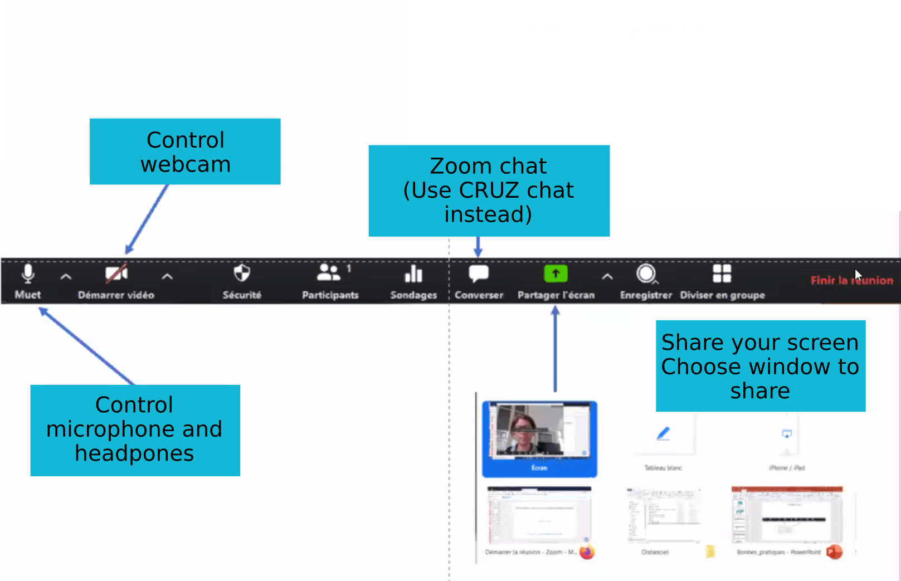
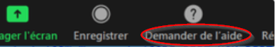

class: slide

```{r, include = FALSE}
knitr::opts_chunk$set(echo = TRUE,
                      warning = FALSE,
                      message = FALSE)
```

### Using Zoom

```{r, echo=FALSE, out.width="95%"}

```

---
class:slide

### Using Zoom


Call for help during a breakout rooms session

```{r, echo=FALSE, out.width="55%"}

```

---
class:slide

### How to interact?

- Please mute your microphone during the slides presentations
- You can share your screen during exercises if you are stuck so that we can help you
- Please cut your webcam off to reduce bandwidth use
  + Please turn it back on for interaction with trainers.
  + To avoid the impression of talking to a wall, trainers can ask 2-3 people to keep their webcam on.

- In case you feel blocked in full screen mode
  + Double click on the full screen should make it come back in a small window.
  + If not, press "Esc"
- In case of "loss" of the bar to switch off your micro/webcam
  + In full screen mode, it appears at the top of the screen
  + Move the mouse over the small green banner with the name of your computer or your name, the menu should appear.

- Tip
  + Hold the space key to temporarily open the microphone.  
  
