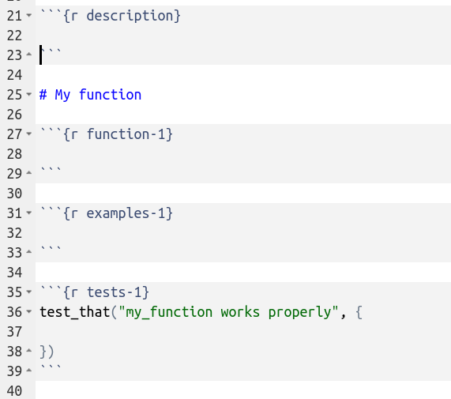

class: slide 

### Let {fusen} deal with the package structure

- Write your Rmd
- Follow the folding lines
- Inflate

```{r, echo=FALSE, out.width="100%"}
knitr::include_graphics("images/fusen_rmd_folds_pkg.png")
```

---
class: slide

### Follow {fusen} folding lines

Four different places to store code and documentation

- **DESCRIPTION**: package documentation
- **'R/'** directory: functions and examples
- **'tests/'** directory: unit tests
- **'vignettes/'** directory: documentation

--
<br/>

#### {fusen} needs to distinguish these places to be able to correctly distribute

```{r, echo=FALSE, out.width="70%"}
knitr::include_graphics("images/fusen_inflate_functions.png")
```

---
class: slide

### Let's inflate the squirrels analysis

- To begin: use the {fusen} template: `fusen::add_dev_history()`
  + Use it as a template for your {fusen}  


```{r, echo=FALSE, out.width="55%"}

```

> _Here, move "nyc_squirrels_rmd_simple.Rmd" to "dev/"_  
> _Use a minimal template: `fusen::add_dev_history(name = "minimal")`_
  
???

We see the 3 first package places: DESCRIPTION, functions and examples, tests.  
The vignette is the Rmd template itself.
  
