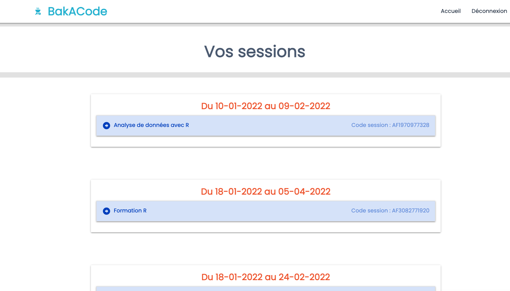
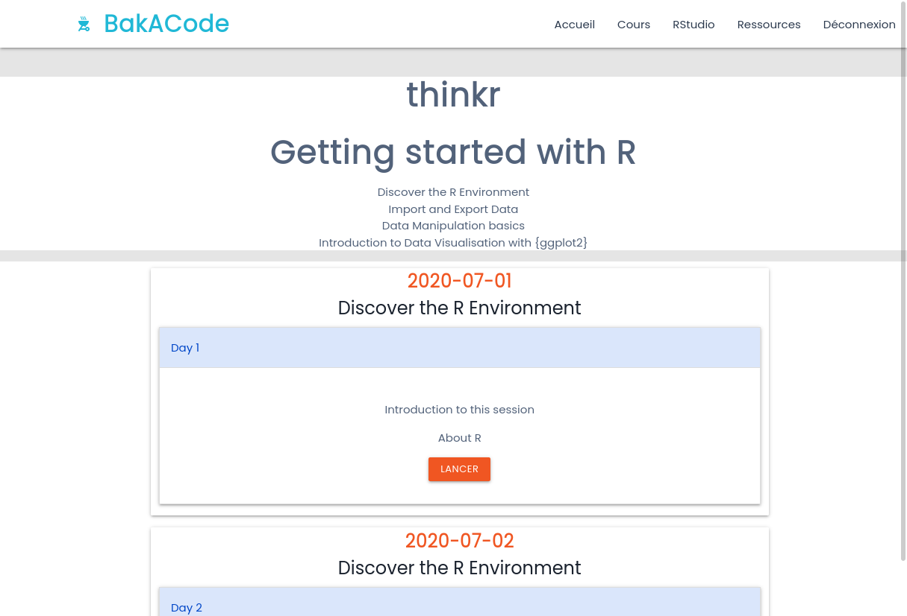
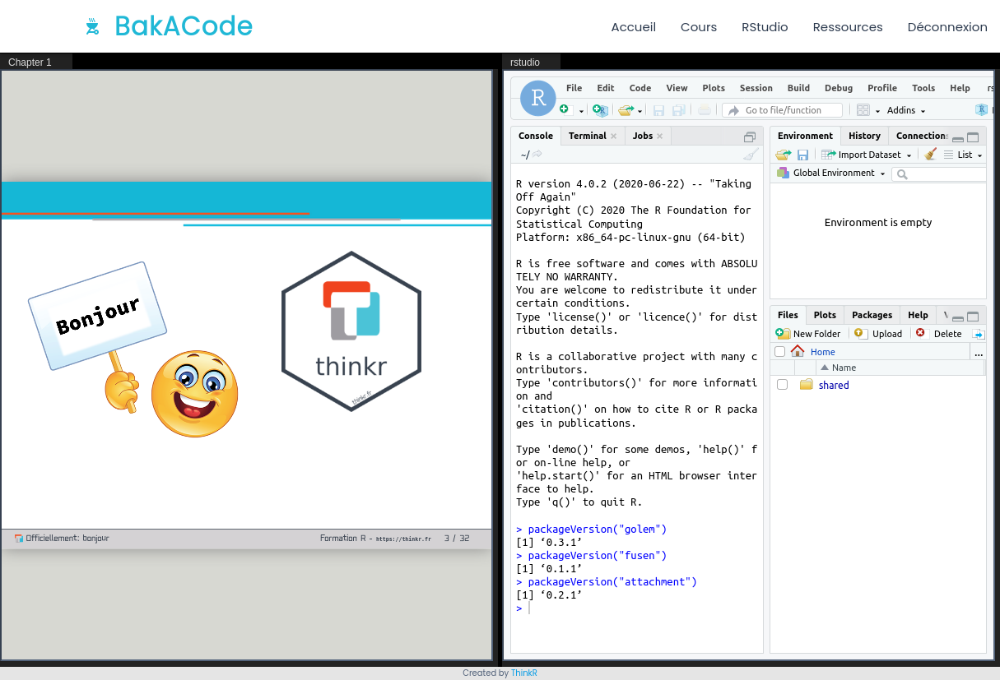
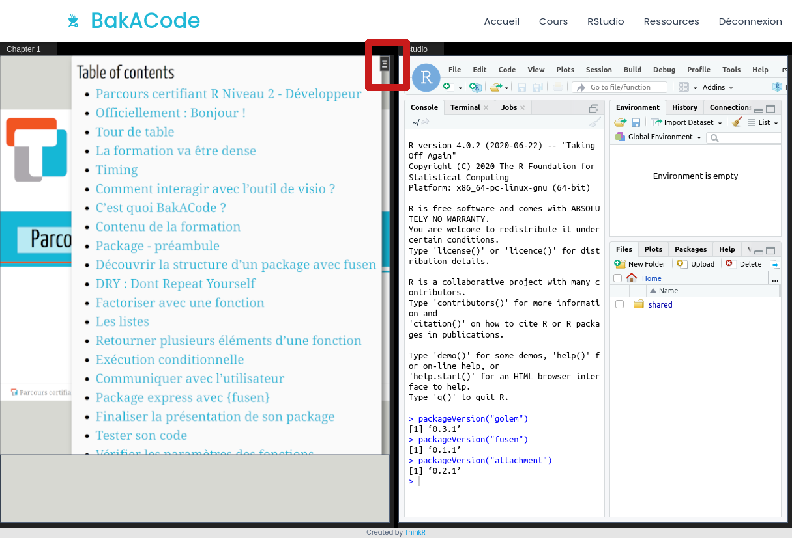
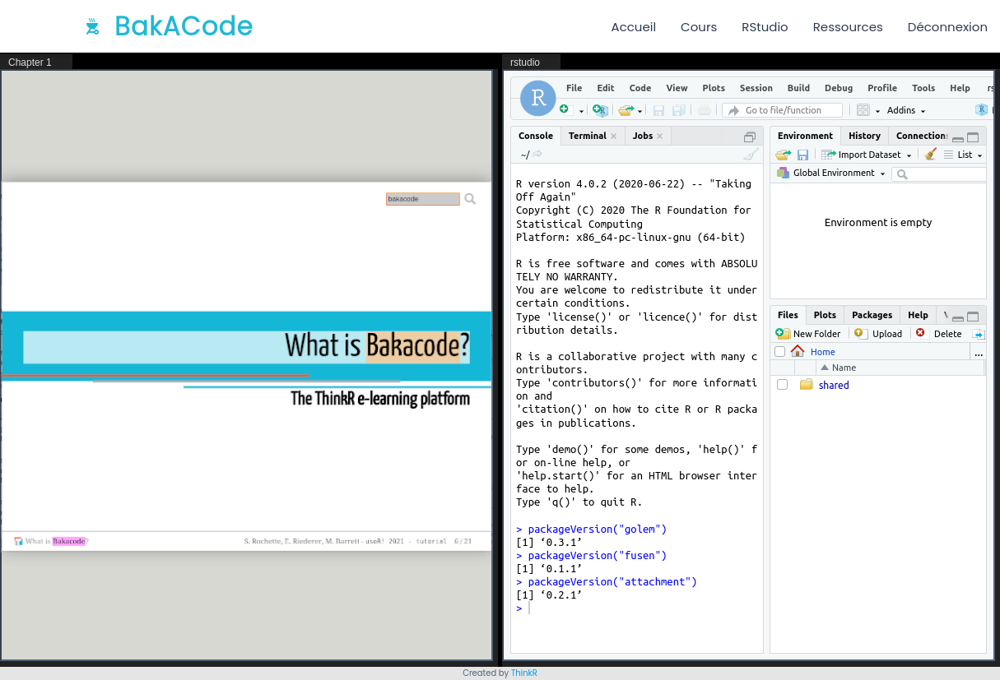

class: slide 

```{r include=FALSE}
knitr::opts_chunk$set(
  cache = FALSE,
  message = FALSE,
  warning = FALSE,
  eval = TRUE,
  fig.align = "center"
)

# pagedown::chrome_print(here::here("courses/M01-presentation/M01S02-a_quelle_sauce_on_va_vous_manger/C05-comment_utiliser_bakacode.html"), here::here("C05-comment_utiliser_bakacode.en.pdf"))

```

### Take a tour!

**BakACode** is the home-made [ThinkR](https://rtask.thinkr.fr) e-learning platform

- Everything you need during the course is available in one place
- The server has all dependencies required for your tutorial
- You can communicate directly with your instructors

<br/><br/>
```{r, echo=FALSE, out.width="55%"}
knitr::include_graphics("images/bakacode_long_3.png")
```
<br/><br/>
**Please take this tour to get used to the platform**

---
class: slide 

### Take the tour and use it to answer the quiz at the end of the chapter

- The instructor creates a file named "hello.Rmd" in the "shared/" directory
  + You will need it for the quiz

--

Now we let you 3 minutes to read the following slides and answer the quiz at the end of this chapter


---
class: slide
### Connection

.pull-left[
```{r, echo=FALSE, out.width="100%"}
knitr::include_graphics("images/baka_login.png")
```
]
.pull-right[
#### Connection

- Use your credentials to connect with username and password
]

Connect to <https://bakacode.io>

---
class: slide
### Sessions

.pull-left[
```{r, echo=FALSE, out.width="100%"}

```
]
.pull-right[
#### Sessions overview

- View your current and past training sessions

]

---
class: slide
### Home page

.pull-left[
```{r, echo=FALSE, out.width="100%"}
knitr::include_graphics("images/baka_courses.png")
```
]
.pull-right[
#### Learning objectives

- Learning objectives of the tutorial

]

---
class: slide
### Home page

.pull-left[
```{r, echo=FALSE, out.width="100%"}
knitr::include_graphics("images/baka_courses.png")
```
]
.pull-right[
#### Learning objectives

- Learning objectives of the tutorial

#### Sections

- A box for each section
- Date and description of the section
- Click on the box to show chapters presented

]


---
class: slide
### Home page - launch

.pull-left[
```{r, echo=FALSE, out.width="100%"}

```
]
.pull-right[
#### Launch tutorial

- Click on the Launch ("Lancer") button to start the tutorial

]

---
class: slide

### Pratice - presentation

.pull-left[
```{r, echo=FALSE, out.width="100%"}

```
]
.pull-right[
#### Vertical separator

- Maintain left click on the vertical bar and use the mouse to change left/right windows ratio

]

---
class: slide

### Pratice - presentation

.pull-left[
```{r, echo=FALSE, out.width="100%"}

```
]
.pull-right[
#### Vertical separator

- Maintain left click on the vertical bar and use the mouse to change left/right windows ratio

#### Slides

- Use arrows of your keyboard to go up and down in the slides
- You can copy-paste code parts

]

---
class: slide

### Pratice - presentation

.pull-left[
```{r, echo=FALSE, out.width="100%"}

```
]
.pull-right[
#### Vertical separator

- Maintain left click on the vertical bar and use the mouse to change left/right windows ratio

#### Slides

- Use arrows of your keyboard to go up and down
- You can copy-paste code parts

#### RStudio server

- RStudio project opened with your data and Rmd files for exercises
- Be sure to work in a project!
]

---
class: slide

### Pratice - search

.pull-left[
```{r, echo=FALSE, out.width="100%"}

```
]
.pull-right[
#### Search chapter

- Click on the slides
- Click on the black box in the top right corner to open the table of content
- Choose your chapter
- Click on the black box to quit the table of content and navigate

]

---
class: slide

### Pratice - search

.pull-left[
```{r, echo=FALSE, out.width="100%"}

```
]
.pull-right[
#### Search words

- Click on the slides
- Use CTRL + F to open the slides search bar or click on the magnifier icon
- Write your word
- Press Enter to find the next occurence of your word
- Use ESC / ECH to quit the search bar and navigate

]

---
class: slide

### Pratice - export

.pull-left[
```{r, echo=FALSE, out.width="100%"}
knitr::include_graphics("images/baka_export.png")
```
]
.pull-right[
#### Download your files

- Download files on your computer
- Select one or more files in the file Pane using checkboxes
- Open the 'More' menu
- Choose 'Export'
- 'Download'
]

> We recommend that you export your full project at the end of the course

---
class: slide

### Top menu

.pull-left[
```{r, echo=FALSE, out.width="100%"}

```
]
.pull-right[
#### Home

- Go back to home page "Accueil"

]
---
class: slide

### Top menu

.pull-left[
```{r, echo=FALSE, out.width="100%"}

```
]
.pull-right[
#### Courses

- Navigate through the list of courses sections available
]

---
class: slide

### Top menu

.pull-left[
```{r, echo=FALSE, out.width="100%"}

```
]
.pull-right[
#### RStudio

- Opens your current RStudio session as full screen in a new tab
- Note that this will close the RStudio session in the "Practice" interface

]

---
class: slide

### Top menu

.pull-left[
```{r, echo=FALSE, out.width="100%"}

```
]
.pull-right[
#### Resources

- Opens a new tab with R cheatsheets as PDF
- You can open or download them

]

---
class: slide

### Top menu

.pull-left[
```{r, echo=FALSE, out.width="100%"}

```
]
.pull-right[

#### Disconnect

- Disconnect from BakACode

]

---
class: slide

## Quiz

- Can you download the pdf of the courses?
  + It is stored in the "pdf/" folder, in the Home directory 
  + If you loose the connection, at least you have the slides
  
- Did you find the "shared/hello.Rmd" file ?
  + You can open it and write your name in it.
  + Save it quickly as it is shared with other attendees!
  
- Can you use the table of content or the search bar to retrieve my email somewhere at the end of the slides?
  + Write it in the chat in private, and keep it for yourself, just in case

