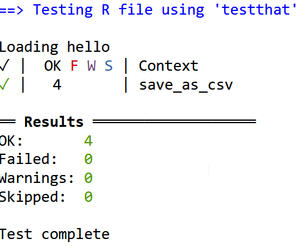

class: slide 
exclude: true
<!-- Add what to test exactly ? How do you think your code may fail ? -->

### Automate the testing of your code


---
class: slide 

### Automate the testing of your code
 
#### Why automate your code testing?

+ To save time!
+ To work peacefully with others
+ To be able to transfer the project 
+ Guarantee the stability of the project

#### {testthat} runs at each `check()`.

- Checks that all functions are still doing what they are supposed to do
- {testthat} is integrated to Rstudio and {devtools}
- Tests can be run with `devtools::test()`

---
class: slide 

### Add a new test file

- Initiate a test file for a specific function: `usethis::use_test("my_function")`
  + Creates a "test/testthat/" folder
  + Adds {testthat} to the `Suggests` of DESCRIPTION
  + Creates "test/testthat.R" (do not touch)
- Create a test file for each function or function family
  + Consistent with function script files in "R/" + Create a test file for each function or function family

> Note that {fusen} will initiate all of these from the `tests` chunks

???

In a regular package, you can add tests manually.  
In {fusen}, tests are added in the `tests` chunks

---
class: slide 

### Writing tests 

Each test file is composed of one of multiple sections, with one or multiple tests:

```{r eval = FALSE}
test_that("detail serie1", {
  test1a
  test1b	
})

test_that("detail serie2", { 
  test2a
  test2b
})

```

If `test2b` fails, I will be informed that it is the second test of "detail serie2" in "my_function" file.

???

Note that if a test fails with {fusen}, you better modify it in the dev_history.Rmd and `inflate()` again

---
class: slide 

### Writing tests 

- Your test functions start with `expect_*(object, expected)`
  + `object` : actual output
  + `expected` : the expected one. 
- If the test fails, the function returns an error
- If the test passes, the function returns nothing

Several types of tests are possible, including:

```{r eval=TRUE, error=TRUE}
library(testthat)

expect_equal(10, 10)

a <- sample(1:10, 1)
b <- sample(1:10, 1)
expect_equal(a + b, 200)
```

---
class: slide 

### Common tests available in {testthat}


```{r eval = FALSE}
# Test using identical
expect_identical()
# Test error management
expect_error()
expect_message()
expect_warning()
# Test character against regular expression
expect_match()
# Test on logical
expect_true()
expect_false()
# Test if object is lower of greater than expected
expect_less_than()
expect_more_than()
# Test the exact length
expect_length()
# Skip a section if server is not available
skip_if_offline()
```

---
class: slide

### What kind of tests do I write?

- Test that function works correctly when inputs are those expected
- Test outputs are correct for a few scenarios of inputs
- Test each scenario that can trigger a specific line of code (like `if()`)
- Test what happens if other formats of inputs are used
  + You may need {assertthat} in your original function
  
--
  
#### Example of test script in a package :

```{r eval = FALSE}
test_that("test weighted.mean", {
  expect_equal( weighted.mean(1:10, w = rep(1, 10)), 5.5 )
  expect_equal( weighted.mean(1:10, w = 1:10), 7 )
})

test_that("log fails ", {
  expect_error( log("a") )
  expect_error( log("bonjour") )
})
```


---
class: slide 

### Quizz: What does this code do ? 

- `save_as_csv()` takes a `dataframe` and a `path` as input and save it as csv using the `path`
  + It outputs the `path`

```{r eval = FALSE}
test_that("test errors save_as_csv", {
  data(iris)
  expect_error(save_as_csv(iris, "does/not/exists/out.csv"), "does not exist")
  expect_error(save_as_csv(iris, "file.R"), "does not have correct output extension")
})

test_that("test correct save_as_csv", {
  data(iris)
  expect_is(save_as_csv(iris, "out.csv"), "character")
  expect_true(file.exists(save_as_csv(iris, "out.csv")))
  expect_equal(iris, read.csv2("out.csv"))
})

```

???

Ask 2 different persons to describe the 2 sections


---
class: slide 

### Run all tests

```{r eval=FALSE}
devtools::test()
```


```{r, echo=FALSE, out.width="35%"}

```


+ Each line corresponds to a test file
+ Each test is counted as `OK`, `FAIL`, `WARNING`, `SKIP`.
+ Each test file is launched in its own environment, it is necessary to think about loading the necessary libraries and data each time  


> Same applies to {fusen}, after `inflate()`, each `test` chunk is run in a separate environment, you need to keep it in mind while writing test chunks

???

- OK when test is good
- FAIL when test fails
- WARNING if a function in the test returned a warning
- SKIP if skip conditions apply


---
class: slide

### Quiz: How to test what is supposed to fail?

- A : `expect_equal()`
- B : `expect_false()`
- C : `expect_error()`
- D : `expect_warning()`

???

- If your function crashes, R returns an error. 
You can catch it with `expect_error()` to avoid crashing the test script
and check that in this case, there is an error.  
It is best if the error is chosen and made explicit in your function with a `stop()` or with {assertthat} for example

- Depending on your definition of fail, `expect_warning()` can also be a good answer. 
Generally speaking, a warning should be something that the user has to correct in his code. It is good practice to put `stop()` or `message()`, but not `warning()` in your functions.

---
class: slide 
exclude: true

### Do it yourself!

**Version A**

Add unit tests to your {mytools} package containing funtions `save_as_csv()` and `clean_names()`.

> Your package must be documented, **tested** and return 0 errors, 0 warnings, and 0 notes

**Bonus**

- Add to your {mytools} package, while working in a new Rmd:

  + A function that returns the first 6 values of a chosen column (as a parameter) from a dataset. The output is a vector.
      + `extract_six_from_col(mtcars, "mpg")` works
      + `extract_six_from_col(mtcars, "toto")` returns an error
  + unit tests for `extract_six_from_col()`

> Your package must be documented, **tested** and return 0 errors, 0 warnings, and 0 notes

---
class: slide 


### TD - Version B

- Add checks to your `say_hello()` function in the {hello} package to ensure that the input variable is a `character`, of size `1`. Stop the function otherwise with `stop()`.
- Provide the message text as a `character` output of the function, reusable for future processing
- Add unit tests to test all possible outputs

> Your package must be documented, **tested** and return 0 errors, 0 warnings, and 0 notes

**Bonus**

- In the {hello} package, create a new function `create_mail_content()` that
  + takes a first name, an email address and a password as input
  + uses the `say_hello()` function as a sub-function to get the text of "Hello Someone".
  + adds mail content after the "hello" formula, saying `remember your mail: xxx@xxx.xx and password zzz`
- Create a reproducible example that takes a dataframe as input with three columns: `firstname`, `email`, `password` and returns a list with content of custom mails
- Test the whole thing!

> Your package must be documented, **tested** and return 0 errors, 0 warnings, and 0 notes

???

Note that reproducible example with `create_mail_content()` could be transformed as a new function to take the dataframe as input directly.

